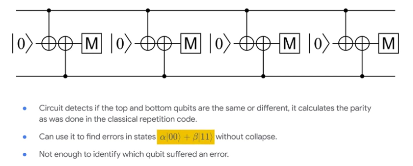

# Quantum error correction

**What are quantum errors?**

Lets discuss all the things that can go wrong when we work with a quantum computer. Lets start with classical error correction fundamentals.

Classical error correction fundamentals:

In case of classical, you want to store a bit 0/1 . But hardware has the prob p per unit time of flipping. Now how do we increase the chance of successful storage. One solution is to store multiple copies, but that alone is not enough since after a time and error occurs with prob p it will still be random. We have to introduce some processing, this could be taking a majority vote. 

Thus ans: store multiple copies and peiodically take majority vote. (assuming this is instant and perfect.)

But as you can we can fail after some time in case of majority vote. These collection of logical bits have higher reliability that any one physical bit. In the above figure, code disatance = 5. (it takes 5 flips to go to the opposite state). Thus we can say that the distance d code can only fail if at least (d+1)/2 errors occur, 

$$p -> O(p^3)$$

For counting the majority vote we also dont need to measure each and every bit (not very quantum friendly).

Pairwise parity measurments:

Now instead of taking the majority votes lets look at pair wise parities. In the sirst example with the single error, you'll find that we have four parities, the first two of which are one, and the bottom two of which are zero. We choose to make a graph out of it, two are red for our odd parity. This then defines a graph problem. If you solve the following problems, connect the highlighted vertices in pairs or to the nearest boundary such that minium edges are used. This is called minimum weight weight perfect matching. The edge highlighted in green is the solution. Now this edge can tell me which bit went bad (second from the top). 

I can choose to correct it or just leave it as knowledge in my system. So that later I can look at it and flip the result. Now more errors can occur and I can use my exisitng knowledge to calculate parities correctly. 

Now in case when I have 2 errors, instead of syaing that the first two bits lead to one, we know that the second bit is wrong so we correct that to give zero. Now I can see only see the endpoints of chain of errors that is the two new ones. Now we have a new graph with two highlighted nodes, and this time solution is 2 green edges. This gives us a belief that middle 3 bits are wrong. We can use this knowledge to get our state. (0,1 , 1, 1, 0). We are going to use our knowledge of errors to flio those middle bits and get back the state we wanted. This is equivalent to majority vote. We will use this in qec too.

**Quantum errors**

A lot more do deal with than classical bit flips. Like in superconducting qubits we have higher excited states, and can lead to leeakge. Now when we interact with a qubit that has leeked, it will corrupt everything it touches. That leekage can spread throught the entire computer.

In this picture, we started with a single qubit in the middle of chip that has leaked, and the just run quantum circuits that's intedned to detetct errors, but its actually doing is spreading error arounf the circuit. This is an example of somehting that is to be designed in the hardware. And if we leave it to error detection system the system is going to fail; the leakage will accumulate, and ultimately the computation will fail. 

Here is another way we can get leekage in our system from the measurment process itself. When we measure qubits we use a particular microwave tone, which you can think of as being reflected slightly by two different states, 0 and 1. It introduces a shift in the signal that is detectable back at room temperature. If you put a lot of power in, in principle you get faster measurments. Now you also have dumped more energy into the system, and that can lead to excitation to higher states. Since we have many qubits attatched to a single line, can lead to a lot of error on lot of different qubits. Thus we need to manage this. 

Next we have our chips at 10milliKelvin and energy scales of our qubits are so low, energy that gets dumped is very significant. This also needs to be handled on hardware.

Conclusion: Real qc are not ideal. We're going to have to rely on the hardware engineers to give us a device that at least satisfies the following. We are going to assume that no matter what, errors can happen, but they leave us in the states zero and one. That allows us to represent these two states as a vector with only two entries. The case of the zero state can be represented by 1, 0, and the case of State 1 represented by the vector 0, 1. If we didn't make this assumption, then we would need longer vectors to represent those higher states, and that would become problematic when it came to doing error detection and correction, so we are going to focus on this case.

Now lets talk about the error we can handle using quantum circuits themselves. (assuming leeakge is taken care of)

Now [[a, b], [c, d]] is the error matrix that can be represented using Pauli matrices.

$$
\frac{a+d}{2}I + \frac{b+c}{2}X + \frac{a-d}{2}Z + \frac{b-c}{2} XZ
$$

Here X representing the bit flip, Z the phase flip, XZ both bit and phase flip. This decomposition can similarly be done for multi qubit gates.

Arbitrary error is a combination of these simple errors. 

Thus, If we can build a quantum computer with only 1 and 2 qubit computation basis errors (not handled at hardware level), then detecting bit and phase flips and tracking them in software is enough.

# Detecting bit-flips and phase flips

For the circuits we have a z basis measurment, we can change the basis of measurment to x basis using Mx.

Lets assume the top line is something that we want to preserve. And the bottom line is the repeated measurments.

Now lets assume we have a flip error on data qubit, when propagated forward its going to change the result of all the future measurments.

Errors create changes in the stream of mesurments coming out measurment qubit.

What about the measurment qubit error. This only flips a single measurment qubit.

Now increasing the complexity and using single measurment qubit to protect two data qubits we can do a little bit more

We still cant do much with this cause we cant tell wherer the error occured.

**Quantum repition code**

Now we have 3 data and 2 measurment qubits. What we care about is whether the measurment is the same as the previous measurment. If no change then no error is detected. This can find a single bit flip. 

Here there are a number of detectors, each pair is a detector.  Parity of set matters.

Here we have a detector with odd parity

If we have a same bit flip error in a different place, now we can get useful information in order to locate the error. A bit flip error in this location is flagged by both the detectors.

This error fired off two detection events. 

In this case the bit flip is detected with the above measurment detectors and then on the below one.

Now based on which detectors are flagged we can locate where the error occured. 

This x error propgated both up and down, and changed the measurments of all later measurment bits. 

This helps us locate that error must have occured on the data qubit shared by both.

In this, based on the location the error is first detected in the upper left and then in lower detectors. (diagonally error? error between these two gates)

Thus we can say that the pattern of detection events can help us locate where the error must have occured. 

The amount of time between these two gates (when diagonal detector flagged)is shorter than this amount of time when case2 (side by side detectors flagged). We can say that the likelihood that we have detection events on this diagonal arrangement is lower than getting a pair of detection events aligned side by side. All of that can be used to help us work out where errors may be.