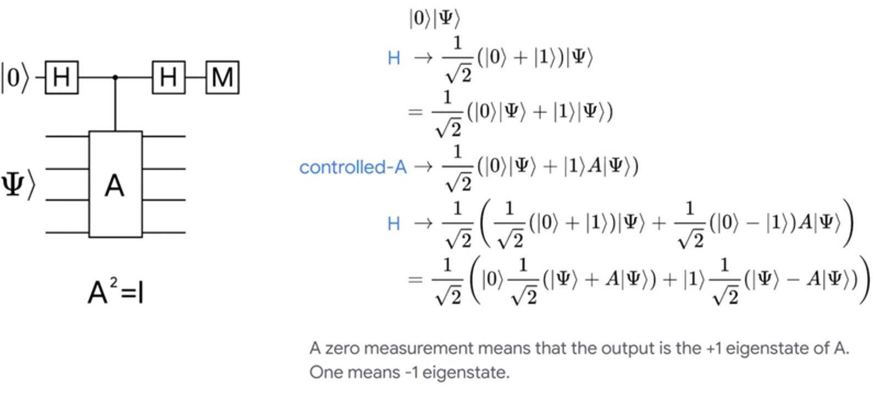
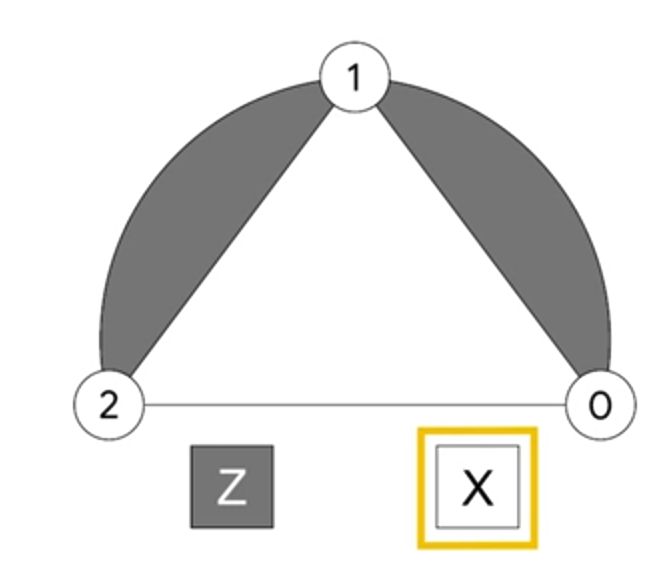

# What is Stabalizers?

The simplest stabalizers are operators that leave some useful state unchanged (these states are the eigenstatets of the associated stablizers and are unique up to global phase given the stabalizer). 

For example:

$Z |0\rangle = |0\rangle$

$-Z |1\rangle = |1\rangle$

$X |+\rangle = |+\rangle$

$-X |-\rangle = |-\rangle$

So this suggests a substitution of notation. If an operator has a well-defined +1 eigenstate, so the state that is unchanged by its application, then instead of writing the state, we can simply write the operator.

$|0\rangle = +Z$

$|1\rangle = -Z$

$|+\rangle = +X$

$|-\rangle = -X$

Why write like this? 

This might not be evident right now but as we move to higher number of states, these become evidently clear. 

Moving to 3 qubit states. Consider the stabalizer $|\psi \rangle = \frac{1}{\sqrt{2}}( |000 \rangle + |111 \rangle)$. This state is stabalized by *3 independent stabalizers* +XXX, +ZZI, +IZZ (any of these applied to state leaves the state unchanged). Thus we can see for complex states, the list of indepenedet stabalizers can be far more compact than the state itself.

## How does this information help in qec?

If an error occured on $|\psi\rangle$, Example:

$$X_2 |\psi\rangle = \frac{1}{\sqrt{2}}( |100 \rangle + |011 \rangle)$$

Now when applying one of the stabalizers of $\psi$, 

$$Z_2Z_1X_2 |\psi\rangle = Z_2X_2Z_1|\psi\rangle$$
$$Z_2Z_1X_2 |\psi\rangle = -X_2Z_2Z_1|\psi\rangle$$
$$Z_2Z_1X_2 |\psi\rangle = -X_2|\psi\rangle$$

So after suffering an error, we have changed the statement of whether we have a plis or minus 1 eigenstate of a particular operator. So if we can measure whether we have a plu/minus eigenstate of our stabalizers we can detect errors. Thus we need a circuit capable of telling us whether a state is a plus or minus one eigenstate of a particular operator. 

Example: Signs of stabalizers after these errors

$$X_2 |\psi\rangle = \frac{1}{\sqrt{2}}( |100 \rangle + |011 \rangle)$$

will be +XXX, -ZZI, +IZZ

$$X_1 |\psi\rangle = \frac{1}{\sqrt{2}}( |010 \rangle + |101 \rangle)$$

will be +XXX, -ZZI, -IZZ

$$X_0 |\psi\rangle = \frac{1}{\sqrt{2}}( |001 \rangle + |110 \rangle)$$

will be +XXX, +ZZI, -IZZ

## Represent stabalizers as a picture

This state

$$|\psi\rangle = \frac{1}{\sqrt{2}}( |000 \rangle + |111 \rangle)$$

can be represented using stabalizers (+XXX, +ZZI, +IZZ), and stabalizers can be represented as a picture

