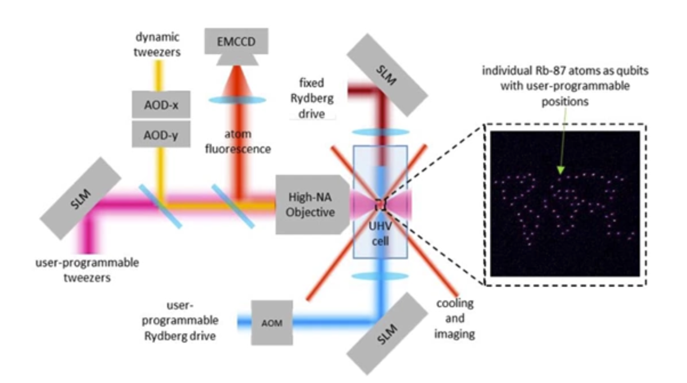
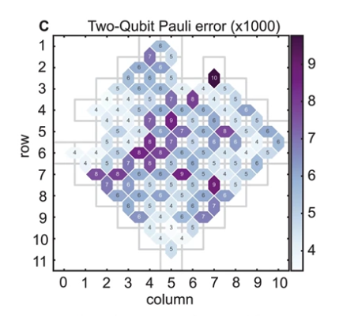

# What is a quantum computer?

Many diverse technologies:

- Annealers (Dwave)
- Ion Traps
- Neutral atoms
- Photons
- Quantum dots (intel, QuTech)
- Superconducting (google, ibm)

**Annealers**:

You have qubits but the focus is not on high coherence, not on well controlled manipulations of states. Rather you have many couplers whic each individually touch many qubits. So here the process becomes applying constrainsts on those qubits and then allowing the computer to settle into states that satisfy as many of those constraints as possible. In general this is an optimiser.

*Lates system has 5000+ qubits*
*There is no known way to apply error correction to this approach.*

As a result as the system gets bigger you need lower temperatures, thus not scalable.

**Ion Traps**

In this we use an electromagnetic trap. Most popular approach, you have a surface on which you have patterned many electrodes. Those electrodes can trap very close to the surface individual atomic ions. And its the internal state of the electrons on those ions that you use to do computing. You can manipulate those states with microwaves, lasers. This system being based on atomic ions has some of the cleanest properties of any system and therefore achieves some of the very highest fidelity gates of any approach to quantum computing.

*Challenges*
speed and scalability (can you make a very high quality vaccum system with many many ions, manipulated with many lasers or microwave sources, and make it work together). 

These systems are not typically very large yet, mostly a few dozen ions.

**Neutral atoms**

*Companies*:

- QuEra
- Pasqal
- ColdQuanta
- Atom Computing
- Planqc
- M Squared

Advantage here is you can trap these with lasers, you dont need a physical set of hardware, no need of electromagnetic rails to trap your atoms. You can set up an egg carton like potential wells, where your atoms can sit in various holes. Trapping is probabilistic but you can then move the atoms around to fill a dense grid. The ability to not need physical hardware to trap your qubits means that these systems have some of the largest qubits counts.

*Challenges*
- Speed
- measurment of the informmation itself leads to its destruction, atoms leave their wells, and you need to continously load new atoms. (needs to solve to scale)

UHC cell is the ultra-high vacuum cell, and you have a source of atoms that gets trapped randomly, and you can then compress it to dense pack of atoms with the arrangement that you wish to have.

**Photonic**

If you have a photonic chip, you can generate single photons probabilistically, entangle them to create bigger quantum state probabilistically. and if you have enough of these sources and enough way od routing the successes to bigger and bigger assemblages of states throwinf away the failures as you go, you can atleast in principle build a system to build a very large quantum state that can be used as the foundation for quantum computations.

*Challenges*:
- Rapidly switching photons: Need to route the photons, you need to do this quickly (when you decide success/faliure you need to respond quickly)
- Overcoming loss: photons love to be absorbed by materials of all kinds are not lost in such high numbers 

**Quantum Dots**

An arrangement of electrodes that trap single electrons, use the states of electron to represent the states of your data.

*Challenges*

- Scale (very samlls 10-100 nm separation btw electrons. You need to have atleast a two-dimensional array of qubits and as yet the research devices dont support that. Without 2d array, if a single qubit fails, maybe because an electron got absorbed into the device itself, or at time of creation the electrodes were not set of right and incapable of holding electrons. So this is a big problem since if you have two such computers they cant talk to each other. To make them fundamentally fault tolerant you need to have 2d arrays or a dropout workaround.)

**Superconducting**

Here you have a regular silicone wafer and you pattern electrical circuits. Here qubits are tunable frequency resonant circuits. Here we use ground state and first excited state to represent 0 and 1. 

*Challenges*
- dealing with higher excited states
- circuits are big, qubit centre to centre is about a mm
- require very low temperature (thermal energy of the system should be small as compared to the energy gap between the ground and first excited state)

- Another challenge is that they dont always work. above picture is the data from an early test chip. When you build a superconducting circuit there are breaks in the circuit like the Josephson junction, whose thickness very sensitively determines the resistence and properties of the circuit. If not very carefully controlled some of the qubits wont work in a way they were designed. As you can see in the picture, error rates of the qubits, some of the qubits are even missing.

- Increasing yield going to larger sizes, going to higher fidelity gates, are the major focus here.

## QUIZ

In which of the following quantum computing architectures are qubits typically mobile?

Ion Traps: Ion traps typically make use of the internal energy levels of single atoms missing a single electron as their qubits. These ions are trapped using electromagnetic fields, and can be moved around by adjusting these fields.

Neutral atoms: Neutral atom quantum computers trap arrays of individual atoms using modulated lasers. By adjusting the modulation, the atoms can be moved.

Photons: Photons are naturally mobile and can be guided by mirrors, waveguides, and optical fibers.

**Note:** Quantum dots are solid state devices, typically containing a single electron, and this electron is not usually considered mobile in a controllable manner.

In the Google superconducting quantum architecture, what is the most common number of qubits any given qubit can interact with?

Four. The bulk of the architecture is a square grid.

