# Probalistic graphical models

[src](https://www.youtube.com/watch?v=9yl4XGp5OEg&list=PLUenpfvlyoa0rMoE5nXA8kdctBKE9eSob&index=21)

It is a way of representing probability distribution. And here the distribution is encoded that we can read the conditional independence strcuture in graphs. As a result we can encode what variables are independent of other variables, encode this in a graph, so we can use graph algorithms to do inference and learning. As a result use Computer Science to reason about probabilties.

## Bayesian Networks

Basyesian networks are used to define bayesian independence structure. What makes a network bayesian, its the nodes in the network and the edges are directed edges. Thus there is a directionality that describes the conditional probability. As a result Bayesian networks has a conditional independence structure. 

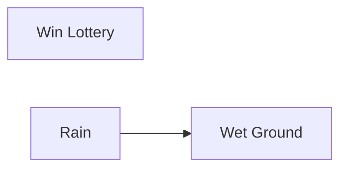
Then the full joint probability distribution $P(L, R, W)$ = $P(L)P(R)P(W|R)$

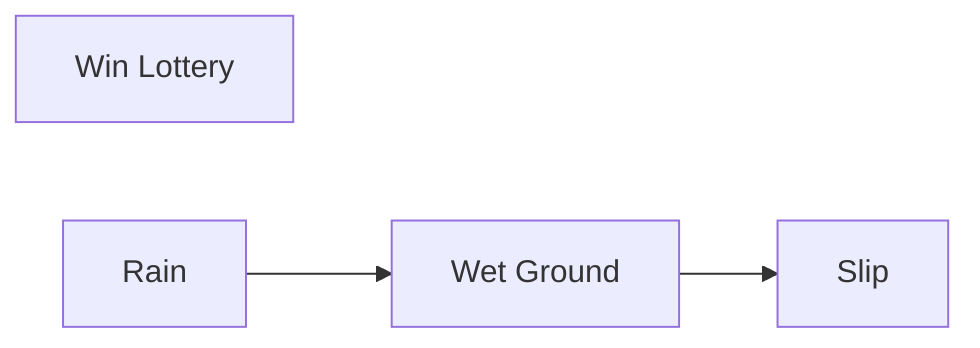

Full joint probability distribution $P(L, R, W, S)$ = $P(L)P(R)P(W|R)P(S|W)$

So the general idea is $P(X|Parents(X))$

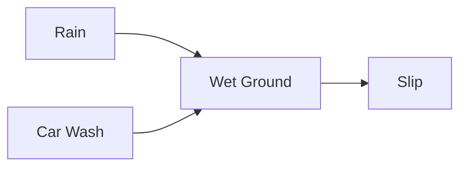
$P(R, C, W, S) = P(R)P(C)P(W|R,C)P(S|W)$

Now lets take two examples:

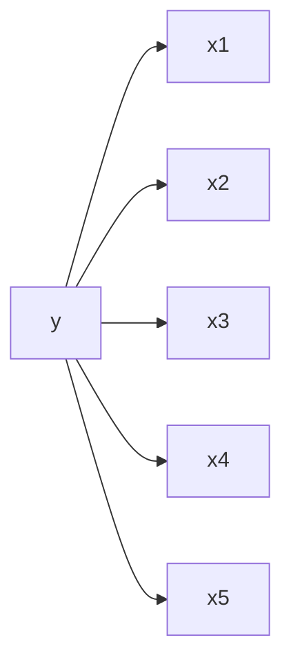

$p(y)\prod_{i=1}^{5}p(x_{i}|y)$

This looks like the naive bayes 

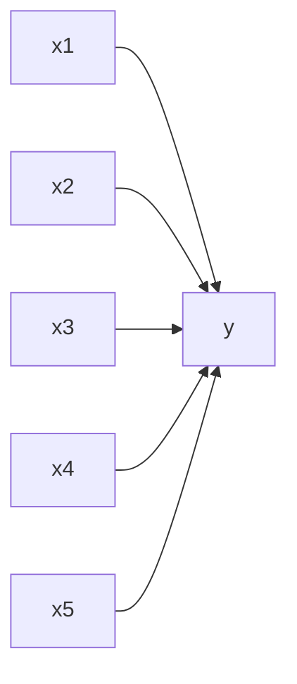

$\prod_{i=1}^{5}p(x_{i})y(x_1|x_2|x_3|x_4|x_5)$

And this looks like logistic regression (with i/p likelihood)

*Conclusion:* Naive bayes has a nice probability distribution in terms of efficiency The reason for this lies in The independence in Bayes Nodes.

## Independence in Bayes Nodes
Each variable is conditionally independent of its non-descendent given its parents. That is each variable is conditionally independent of any other variable given its Markov blanket. 

**Markov blanket:** Parents, children, children's parents. 

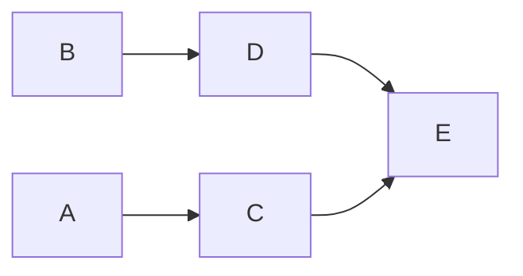

Node C's markov blanket is A, D, and E. 

How we can use this independence?

## Inference
Now given a bayesian network describing $P(X, Y, Z)$, what is $P(Y)$?

**Approach1: Enumeration**

If we had the distribution we looked at before $P(L, R, W, S)$ = $P(C)P(R)P(W|C, R)P(S|W)$
And now i just want to know if its raining or not, then

$P(R) \propto \sum_{w} \sum_{c} P(R)P(C)P(W|C,R)P(S|W)$

Now we had to sum over all possible w and c values, which will increase the complexity as the number of variables increase. Thus expensive k^O(n). We should see how we can take advtange of the bayesian structure to alleviate this problem. 

First step, lets simplify this

$P(R) \propto P(R) \sum_{w} \sum_{c} P(C)P(W|C,R)P(S|W)$
$P(R) \propto P(R) \sum_{w} P(S|W) \sum_{c} P(C)P(W|C,R)$

Now the complexity of the term $\sum_{c} P(C)P(W|C,R)$ is $O(2^n)$ (if there are n binary variables in the conditional, then we'll need $2^n$ configs of these variables which require $2^n$ probability values)

As you can see the total cost will be all posibilities of w and c. Which is costly.

Solution: Variable Elimination

**Approach2: Variable Elimination**

$P(R) \propto \sum_{w} \sum_{c} P(R)P(c)P(w|c,R)P(S|w)$

Because of the way the bayesian network has split up all these conditionally independent terms, we can try to isolate one variable at a time. Example: lets look at the C variable first.

$f_C(w) = \sum_{c}P(c)P(W|C, R)$

Since c is a binary terms, there is only two terms we have to sum over. And at the end we will have a function which has w as input (true/false). Which computationally isnt too bad. And now, 

$P(R) \propto \sum_{w} P(R)P(S|W)f_C(w)$

Let's run through a more general example:

Lets say we have $P(W, X, Y, Z) = P(W)P(X|W)P(Y|X)P(Z|Y)$, whats the probability of $P(Y)$?

$P(Y) = \sum_{w}\sum_{x}\sum_{z}P(w)P(x|w)P(Y|x)P(z|Y)$

Now when we run variable elimination, 

$f_{w}(x) = \sum_{w}P(w)P(x|w)$
$P(Y) = \sum_{x}\sum_{z}P(Y|x)P(z|Y)f_{w}(x)$

$f_x(Y) = \sum_{x}P(Y|x)f_{w}(x)$
$P(Y) = \sum_{z}P(z|Y)f_{x}(Y)$

Order of this elimination?

Some orders will eliminate large tables quickers, some will keep them around longer. A lot of this reasoning comes with structure. As we can see this is a chain structure, 

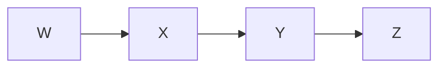
Conclusion on Varibale Elimination:

1. Every varibale that is not an ancestor of the query variable, or evidience variable is irrelevant to query.
2. Iteration
   1. Choose variables to eliminate
   2. sum terms relevant to variable, generate new factor
   3. until no more to eliminate
3. Exact inference is NP-Hard
   1. in tree-structured BNs linear time (in number of table entries)

Learning in Bayesian Nets? -> estimate conditional probability

## Markov Models
A particular type of graphical model useful for analysing time series and sequences.

**Note:** The basic concept between probabilistic graphical models is we are going to use a special data structure to describe the conditional independence structure of a joing probability distrubiution (delcare where the independence is in a distribution) 

We can think of distributions on a scale of how much independence there is in a distribution.

little/no dependence end : independent & identically distributed (i.i.d) and the other end max dependence: full joint distributions.
And its cheaper, easy and embarrasingly parralel to work with no dependence distributions, and super expensive to work with highly dependent distributions.
We need to find something thats not fully iid and not fully joint distribution. And thats what graphical models buys us, it allows us to explore the space of partailly independent distributions.

**Time Series**

Here we have observations overtime.

Example: Stock data, weather, radar informations. 

Initially we will assume we discrete observations at different time steps. Often we have 2 possible goals: prediction and filtering/smoothening.

Lets talk about what model we are going to use.

**Markov Model**

The Markov model is based on the assumption, the past is independent of the future given the present. (No need to know anything about the past to know the future, given I have the present.)

$p(x_{i},x_{k}|x_{j} = p(x_{i}|x_{j})p(x_{k}|x_{j})$ given $i<j<k$

This simplifies the model.

And more generally:

$p(x_{1}, ...., x_{T}) = p(x_{1}) \prod_{t=1}^{T-1}p(x_{t+1}|x_{t})$ 

Given this model, lets see how weel are inference/ variable elimination works:

Now given:

$p(x_1, x_2, x_3, x_4) = p(x_1)p(x_2|x_1)p(x_3|x_2)p(x_4|x_3)$

Whats $p(x_4)$?

$p(x_4) = \sum_{x_1, x_2, x_3}p(x_1)p(x_2|x_1)p(x_3|x_2)p(x_4|x_3)$

Lets discuss the computational costs, considering all states are binary, that means the summation has to sum over $2^3$ possible states. And if T states, the $2^T$ possible states.

Performing variable elimination, starting with x1

$\alpha_2(x_2) = \sum_{x_1}p(x_1)p(x_2|x_1)$

$p(x_4) = \sum_{x_2, x_3}\alpha_2(x_2)p(x_3|x_2)p(x_4|x_3)$

$\alpha_3(x_3) = \sum_{x_2}\alpha_2(x_2)p(x_3|x_2)$

$p(x_4) = \sum_{x_3}\alpha_3(x_3)p(x_4|x_3)$

The above equation reveals:

$p(x_2) = \alpha_2(x_2) = \sum_{x_1}p(x_1)p(x_2|x_1)$

$p(x_3) = \alpha_3(x_3) = \sum_{x_2}\alpha_2(x_2)p(x_3|x_2)$

Lets also discuss the computational complexity here, in this chain graphical model, each elimination results in same amount of work. 2 summation possible states, and we have to do T time (3 in this case). So total complexity 2T (reduced to linear from exponential).

Looking at the general form:

**Forward Message Passing**

Having T total time steps variable, computing iteratively

$p(X) = p(x_{1}) \prod_{t=1}^{T-1}p(x_{t+1}|x_{t})$ 

and we here iteration this
$p(x_{t+1}) = \sum_{x_t}p(x_{t+1}|x_t)$

from 1 to T-1. We are doing this dynamic programming approach, where we do not have to recurse each time, we have precomputed $p(x_t)$

But now:

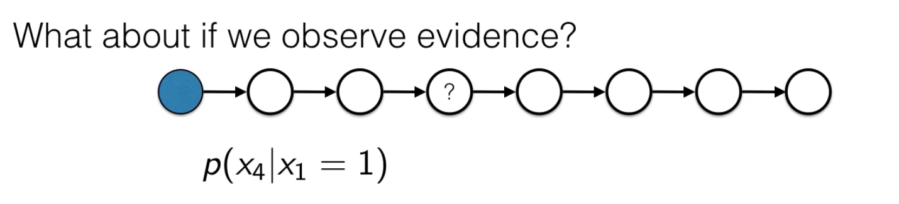

We observe x1, then that changes a few things. How we can solve then is we condition on x1, and each of these intermidiary states become $p(x_{t+1})|x_1=1)$. 

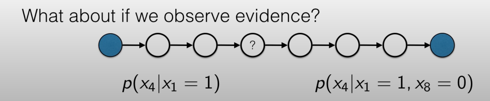

But what if we observe somthing that we were trying to predict later. In the previous case we could propagate forward the conditional probability. We will take that forward till we get to x4. But in the 2nd situation $x_8 = 0$, if we only go forward then we wont be able to incorporate the evidence of $x_8$. Thus we probably will need something backwards too.

**Hidden Markov Model**

Here we work with the realistic assumption that we dont get to observe the real state of any time series. Instead we observe some indication of the true state. 

Example: a submarine sending sonar randiations to detect objects.

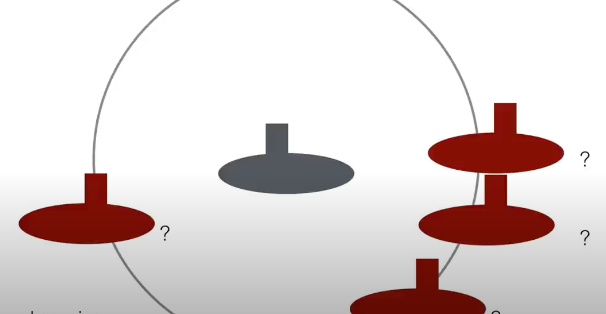

Here I can detect the distance of the objects but not the actual state of the world. If we(submarine) dive a bit, then the sonar radiation from the same objects change. And its unlikely that the other submarines are also moving. And now we have some undertanding how the true state of this world transitions. This will help when we have noisy observations, to make predictions of the correct probabilty distribution.

Given: x (true state) and y (observations)

probability of observing some observation y given the true state x $p(y_t|x_t)$. This is observation probability.

probability of going from one state to another state $p(x_t|x_{t-1})$. This is transition probability.

Together you get a joint probability distribution combining all states and all records

$p(X, Y) = p(x_1)\prod_{t=1}^{T-1}p(x_{t+1}|x_{t}) \prod_{t'=1}^{T}p(y_{t'}|x_{t'})$

This looks exactly like markov model (the transition terms) without the last term.

And with the complete finshed terms (transition + observation):

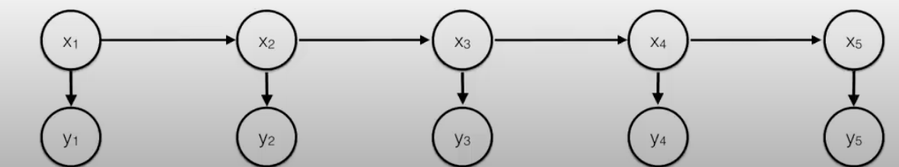

At each time step we have a observation variable coming off of the markov chain, called hidden since we get to observe y and not x and we need to reason about x based on y.

One common task with hidden markov models is to infer the hidden state probabilities. 

**Hidden State Inference**

Here you are given all the y's (observation) and our goal is to predict the x's/x at a time instant.

$p(x_t|Y)$. How we calculate this?

We calcaulete $\alpha_t(x_t)=p(x_t, y_1, .., y_t)$. This alpha is called messages. This is the joint probability between the current state $x_t$, and all the observations up until this point. And the other thing is, 
$\beta_t(x_t) = p(y_{t+1}, ...., y_T|x_t)$, these are probabilities of future observations given current state. 

Why are we interested in these two:

$\alpha_t(x_t)\beta_t(x_t)=p(x_t, y_1, .., y_t)p(y_{t+1}, ...., y_T|x_t) = p(x_t,Y)$

After normalising (summing out the probabilities of Y) we get $p(x_t|Y) \propto p(x_t,Y)$

Lets discuss how we calculate alphas and betas. We do it in two stages:

**Forward Interference**

$\alpha_t(x_t)=p(x_t, y_1, .., y_t)$.

on the first step of markov chain, $p(x_1, t_1) = p(x_1)p(y_1|x_1)$, and this is $\alpha_1(x_1)$.

$p(x_2, y_1, y_2) = \sum_{x_1}p(x_1, y_1)p(x_2|x_1)p(y_2|x_2)$, and thus is $\alpha_2(x_2)$

$\alpha_2(x_2) = \sum_{x_1}\alpha_1(x_1)p(x_2|x_1)p(y_2|x_2)$

Thus we can say:

$p(x_{t+1}, y_1, .. , y_{t+1}) = \alpha_{t+1}(x_{t+1}) =  \sum_{x_t}\alpha_t(x_t)p(x_{t+1}|x_t)p(y_{t+1}|x_{t+1})$

Each time we calculate new alpha, suppose we already computed previous alpha then thats just a look up operation O(1). And then for variable with K possible states, and summation over k states so thats O(k). Now we have to do this for T alpha, total complexity = O(T*k).

**Backward Interference**

$\beta_t(x_t) = p(y_{t+1}, ...., y_T|x_t)$

This beta is referring to probability of future evidence. The boundary case with $x_T$ (the last time step in data), in that the future evidence is null.

$p({}|x_T) = 1 = \beta_T(x_T)$ -> probability of nothing occuring.

Now, 
$\beta_{t-1}(x_{t-1}) = p(y_{t}, ...., y_T|x_{t-1})$
$\beta_{t-1}(x_{t-1}) = p(y_{t}, ...., y_T|x_{t-1}) = \sum_{x_t}p(x_t|x_{t-1})p(y_{t+1}, ...., y_T|x_t)$

The probaility that we transition to $x_t$ from $x_{t-1}$ = $p(x_t|x_{t-1})$ 
The probability of all future evidence for us if we are living in t-1 = $p(y_{t+1}, ...., y_T|x_t)$ 

we can break the second term further

$\beta_{t-1}(x_{t-1}) = p(y_{t}, ...., y_T|x_{t-1}) = \sum_{x_t}p(x_t|x_{t-1})p(y_{t+1}, ...., y_T|x_t)$

$\beta_{t-1}(x_{t-1}) = p(y_{t}, ...., y_T|x_{t-1}) = \sum_{x_t}p(x_t|x_{t-1})p(y_t|x_t)p(y_{t+1}, ...., y_T|x_t)$

$\beta_{t-1}(x_{t-1}) = p(y_{t}, ...., y_T|x_{t-1}) = \sum_{x_t}p(x_t|x_{t-1})p(y_t|x_t)\beta_t(x_t)$

**Fusing the messages**

$\alpha_t(x_t) = p(x_t, y_1, ..., y_t)$

$\beta_t(x_t) = p(y_{t+1}, .., y_T|x_t)$

$\alpha_t(x_t)\beta_t(x_t) = p(x_t, y1, ..., y_t)p(y_{t+1}, .., y_T|x_T) = p(x_t, Y \propto p(x_t|Y))$

Now what will be:

$p(x_t, x_{t+1}| Y) = \frac{p(x_t, x_{t+1}, y_1, ..., y_t, y_{t+1}, y_{t+2}, ... y_T)}{p(Y)}$

where past and resent evidence = $ y_1, ..., y_t$, and $y_{t+1}$ is the next step evidence. And the $y_{t+2}, .. y_T$ is the future evidence. 

If we simplify this:

$p(x_t, x_{t+1}| Y) = \frac{p(x_t, x_{t+1}, y_1, ..., y_t, y_{t+1}, y_{t+2}, ... y_T)}{p(Y)}$

$p(x_t, x_{t+1}| Y) = \frac{p(x_t, y_1, ..., y_t) p(x_{t+1}|x_t)p(y_{t+2}, y_{t+2}, ... y_T|x_{t+1})p(y_{t+1}|x_{t+1})}{\sum_{x_T}p(x_t, Y)}$

$p(x_t, x_{t+1}| Y) = \frac{\alpha_t(x_t)p(x_{t+1}|x_t)\beta_{t+1}(x_{t+1})p(y_{t+1}|x_{t+1})}{\sum_{x_T}\alpha_T(x_T))}$

**Summary**

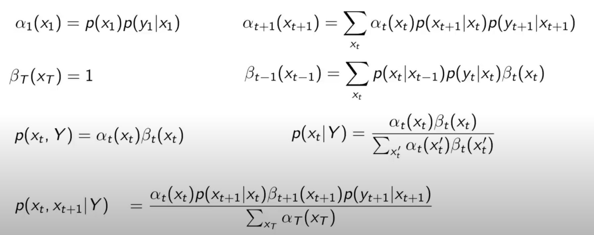

**Normalisation**

To prevent them from underflowing

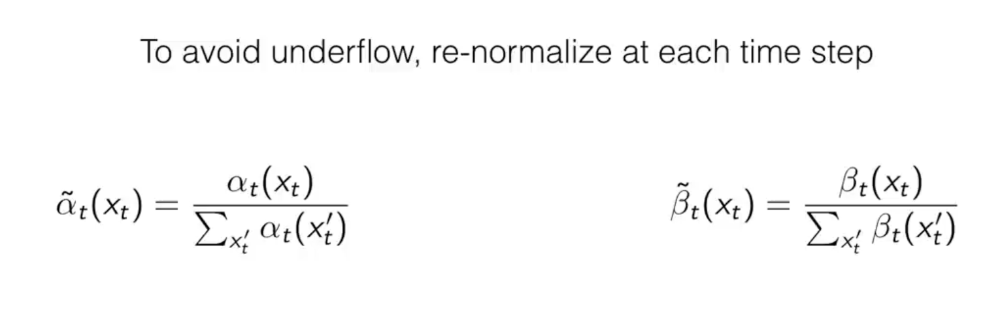

**Undirected Graphical Models**

Recall in a bayesian network you have nodes representing variables, edges representing conditional probabilities btw variables. The edges here are directed. And they need to be acyclic to be called bayes net.
Why? Because of the below reasons:

is cyclic:

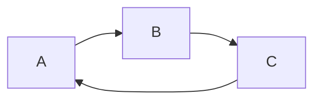

A->B->C->A

P(A, B, C) = P(B|A)P(C|B)P(A|C) = P(B, C|A)P(A|C) = P(A, B, C|C), which doesnt make much sense.
This will make sense only if all P(A) = P(B) = P(C) = 1.

Conclusion: All meaningful bayesian nets are DAGS.

In case of an undirected graphical model, the edges represent the potential functions between variables, so there are some function in factorised probability distribution between variables.

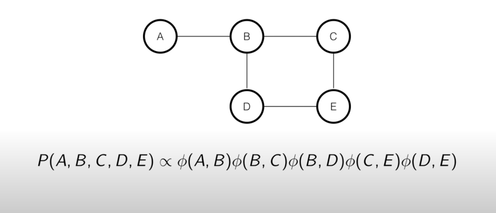

Given an undirected graphical model, where nodes represent variables but the edhes represney something else, the way we interpret it is, the joint probability distribution of the variables in the graph factorize into individual clique potential functions. Where the potential functions corresponding to each cleek of variables. cleek in graph theory is a subset of vertices such that every two distinct vertices in the clique are adjacent. 
Cliques in the above graph are just the edge pairs, : (A, B), (B, C), (B, D), (C, E), (D, E). As the structure of graph changes the cliques will change. 

The general class that uses undirected graphical models is the Markov Random Fields

**Markov Random Fields models**

Here we have certain independence properties that obeys markov properties.

In case of MRF, any two subsets S and R of variables are conditionally independent given a separating subset (can think of this as a wall btw the two). All paths between S and T must travel through the separating subset.

In the undirected graph we considered above, Let S be A node and T be node C. paths between A and C: [A,B,C], [A, B, D, E, C]. 

Then possible separating subsets would be : [B, D], [B, D, E], [B, E] --> separating subsets. These can make S and T conditionally independent.

**Independent Corralaries**

Properties of MRF
- Any two non-adjacent variables are conditionally independent given all other variables.
- Any variable is conditionally independent of all the other variables given its neighbors. 
  - Markov Blanket (even simpler than bayes net)
  
**Bayesian networks as MRF**

Whats the relationship between the bayesian networks and the mrfs.

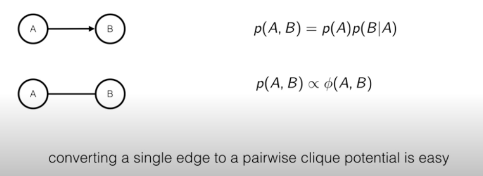

But when we have a chain of variables,

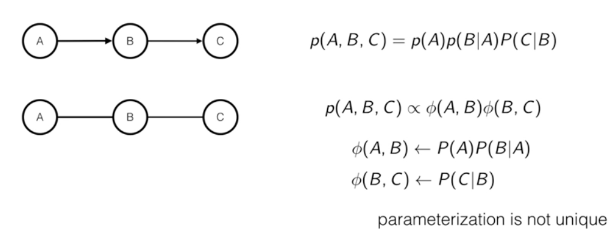

We can choose value for potential functions such that the above two equations are equal. Although the parameterisation isnt unique, but they arent difficult to convert too.

Lets analyse shared parents, 

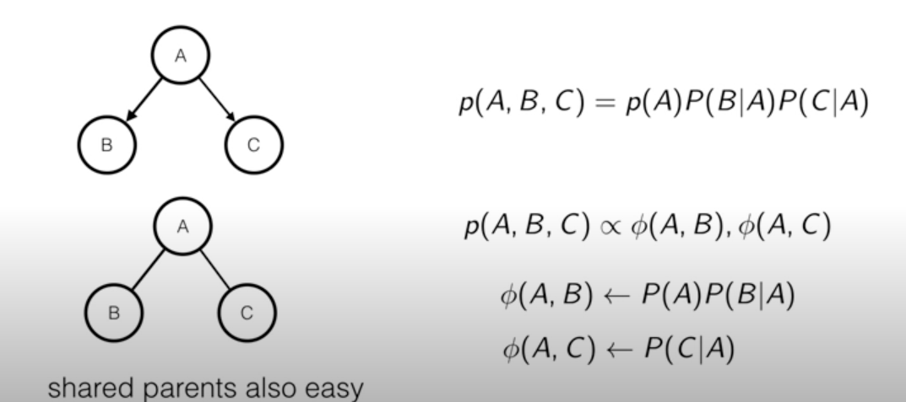

Now in case of shared child, 

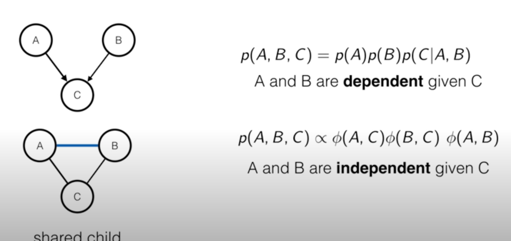

In case of bayesian nets, A and B are dependent given C, that is if we observe C, A and B are dependent on each other. Whereas in case of mrf if we observe C and C act as a separating subset A and B are independent of each other. But these two statements contradict each other, as a result there couldnt be a way to define the $\phi$ functions that mimic the probability distribution above. 

Solution: moralising the parents. If you have a shared children, you have two connect them in mrf. If A and B have a common child then A and B should be connected. So we introduce a new parent function. And now A and B are dependent.

**Convertign bayes nets to MRFs**

- To convert the bayes nets to mrfs, we need to moralise all the co-parents
- But we lose marginal independence of the parents. Thus we loose some information.

As a result we can say that like Directed and undirected graphs, bayes nets and mrfs relationship are different but overlapping classes.
So, although we can convert a bayes nets to mrfs, mrfs do not compass all bayes nets.

**Inference in MRFs**

probabaility distribution: $P(X) = \frac{1}{Z}\prod_{c \in cliques(G)} \phi_c(x_c)$

marginal prob distribution: $p(X_s = x_s) = \sum_{x:X_s=x_s}\frac{1}{Z_s}\prod_{c \in cliques(G)}\phi_c(x_c)$, summing over all the possible states of all the X vector, such that $X_s=x_s$

Thus for the undirected graph:

$P(A, B, C, D, E) \propto \phi(A, B) \phi(B, C)\phi(B, D)\phi(C, E)\phi(D, E)$

$p(A=a) \propto \sum_{a, b, c, d, e} \phi(a, b)\phi(b, c)\phi(b,d)\phi(c, e)\phi(d, e)$

And, $phi(a, b):= \phi(A=a, B=b)$

Now this is very expensive. example if I have k variables and n states so its $k^{n-1}$ different states.

Solution: Sum-Product Belief Propagation.

**Sum-Product Belief Propagation**

This variant of belief propagation is used to calculate marginal probabilities. The foundations of belief propagation is that they pass messages btw variables.

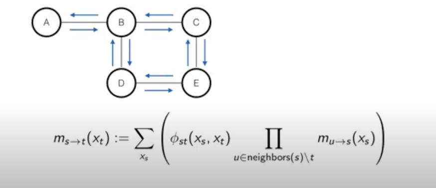

So the message is from s to t, and messages are functions of the variables that is receiving the message. (xt as input). And once you compute adjacent messages from the neighbours you compute beliefs. These beliefs represnet the estimated marginal probabilities of each individual variable.

$b_t(x_t) \propto \prod_{s \in neighbours(t)} m_{t->s}(x_s)$

Note, the prod inside the sum exclude the one that is receiving the message, so you're always sending message between two adjacent variables. In order to compute the message, we have to collect messages from each of the neighbors of sender variable except the receiver.

Lets see how will we compute the message sent from B to D,

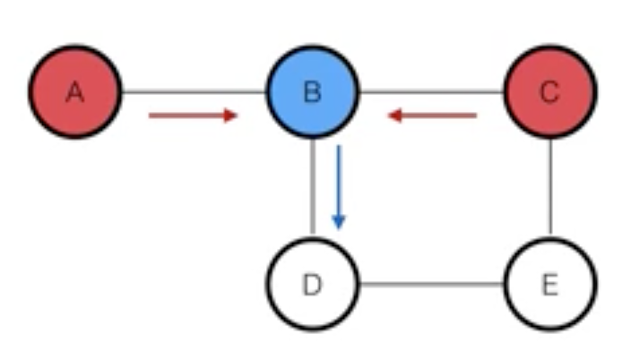

- collect messages from B's neighbours (A and C). And A and C send these messages to B and we use to calculate the product inside the summation.
- And then we pass that to variable D.

$m_{B->D}(x_D) = \sum_{x_B}\phi(x_B, x_D)*m_{A->B}(x_B)*m_{C->B}(x_B)$

In calculation belief we wont be excluding D,

$b_B(x_B) \propto (m_{A->B}(x_B))(m_{C->B}(x_B))(m_{D->B}(x_B))$

Thus we can say that, sum-product messages are:
- functions of receiving node's variables
- vectors for discrete variables
- Can (should) be normalised
- Alternate form explicitly encodes unary and edge potentials.

This is how belief changes with unary potentials,

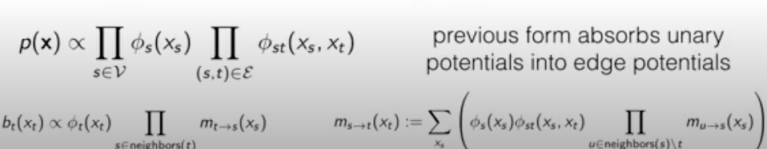

What we have yet discussed is the loopy message passing method. Another way we can do this, is using scheduling message updates.

**Scheduling message updates**

If we have an mrf graph structure with no cycles, loopy bp should work fine. 

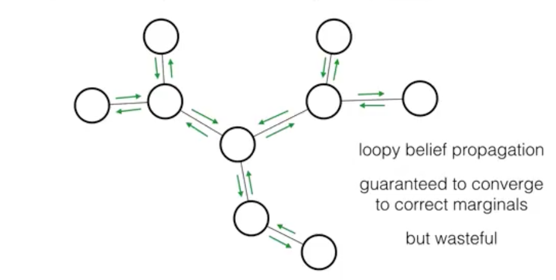

Wasteful since there are better methods to run on tree graphs.

**Collect and distribute**

- collect all the messages to a root.

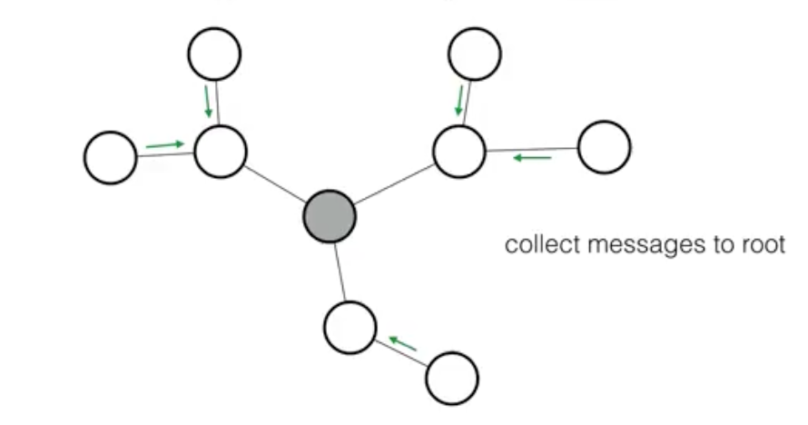
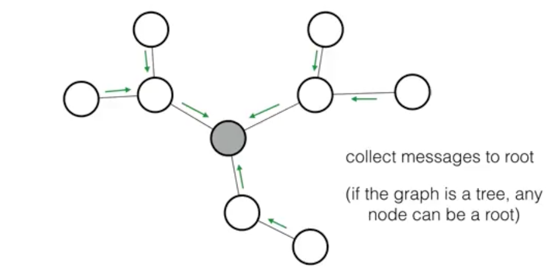

Once we have collected all the messages to the root, now we distribute back to leaves.
Note: once I have collected the information, there is this hierarchical strcture that the root has information about all this subtrees. The neighbors of roots has information about their sub trees. At this point, root can send messages to all its descendants.

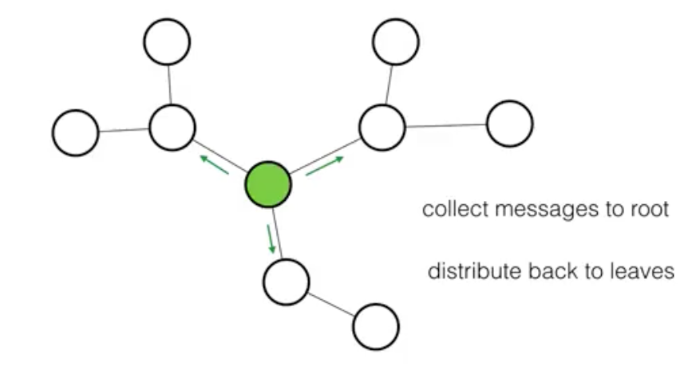
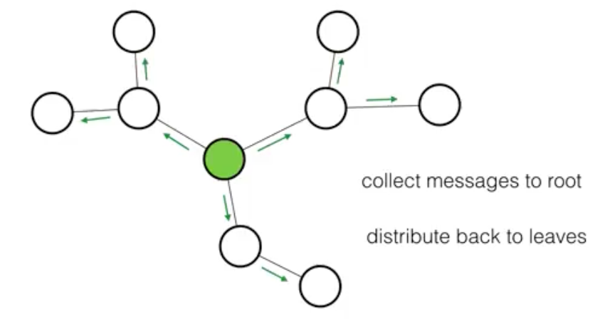

Advt of this BP in Trees
- Guranteed to converge to marginals just like loopy bp
- Collect and distribute "converges" with just one update per message
- Guarantees not as nice in non-trees
  - rule of thumb: treat loopy BP as approximate inference. (since mrf are seen as general purpose models, where we can change the strcuture of the field as modelers, then the best thing we can do is get a good approx with loopy bp.)

Note: This is similar to what we saw in hidden markov models

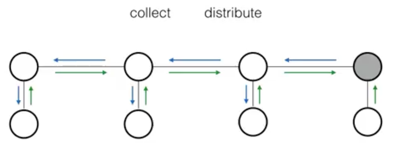

collect messages from leaves (observations) and estimated beliefs of the current state. And distribute to leaves, (usually not to observations we already observed).

**Conclusion:**

- Collect evidence and distribute (serial order) in trees: exact marginals
- Iterate in loopy graphs: approximate marginals (this iteration is usually done in parallel)
- Messages are related to Lagrange multiplier for enforcing  consistency constraints on estimates marginals. (In case of BP, the marginal probabilities we know that all numbers between 0 and 1 form valid marginal prob. If we write out constraints for enforcing validation of marginal probabilities to be truly from the joint prob distribution we will have exponential constraints. We can simplify these constarints to linear constraints because of the factorization. And we end up with simple euqality constraints along the factors of the MRF, and now if we try to enforce those constarints with Lagrange multipliers and try to optimise the objective function, then we end up with the bp message passing update rules.)
- 

