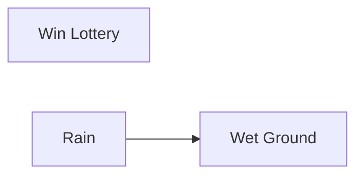
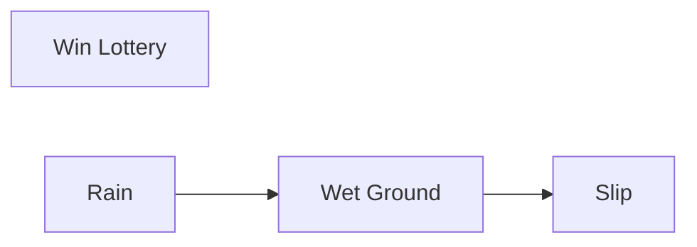
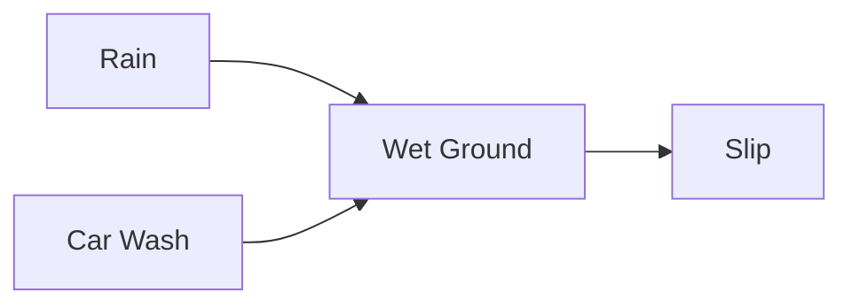
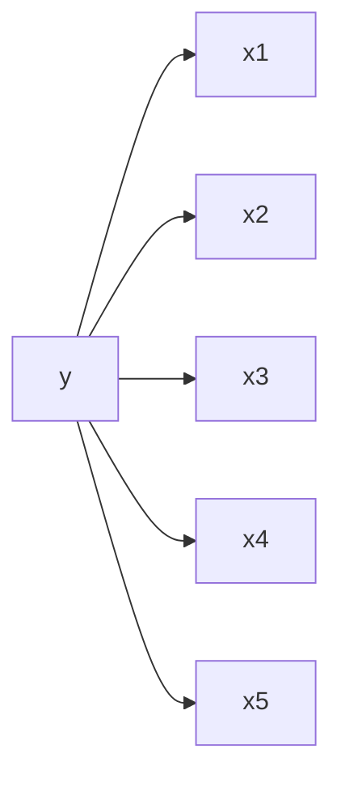
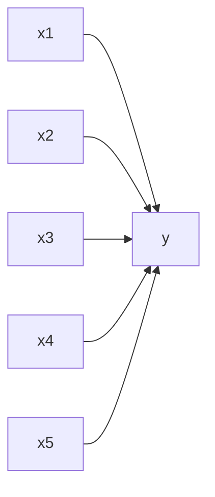
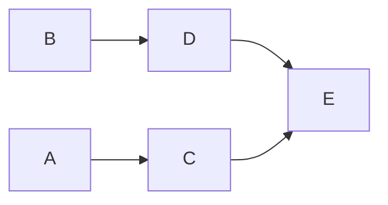
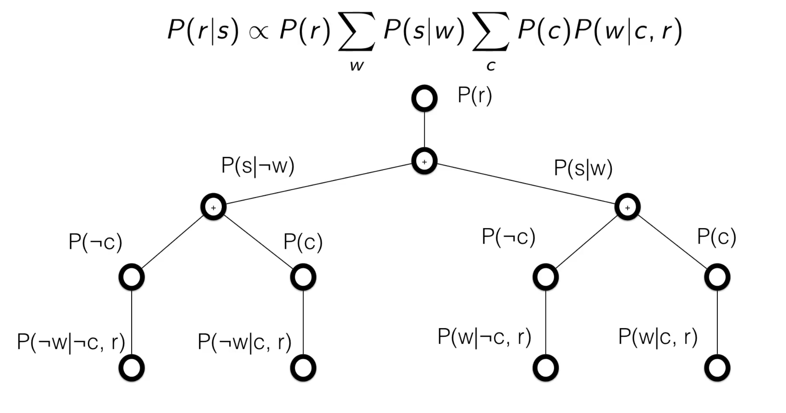

# Probalistic graphical models
It is a way of representing probability distribution. And here the distribution is encoded that we can read the conditional independence strcuture in graphs. As a result we can encode what variables are independent of other variables, encode this in a graph, so we can use graph algorithms to do inference and learning. As a result use Computer Science to reason about probabilties.

## Bayesian Networks

Basyesian networks are used to define bayesian independence structure. What makes a network bayesian, its the nodes in the network and the edges are directed edges. Thus there is a directionality that describes the conditional probability. As a result Bayesian networks has a conditional independence structure. 

Then the full joint probability distribution $P(L, R, W)$ = $P(L)P(R)P(W|R)$

Full joint probability distribution $P(L, R, W, S)$ = $P(L)P(R)P(W|R)P(S|W)$

So the general idea is $P(X|Parents(X))$

$P(R, C, W, S) = P(R)P(C)P(W|R,C)P(S|W)$

Now lets take two examples:

$p(y)\prod_{i=1}^{5}p(x_{i}|y)$

This looks like the naive bayes 

$\prod_{i=1}^{5}p(x_{i})y(x_1|x_2|x_3|x_4|x_5)$

And this looks like logistic regression (with i/p likelihood)

*Conclusion:* Naive bayes has a nice probability distribution in terms of efficiency The reason for this lies in The independence in Bayes Nodes.

## Independence in Bayes Nodes
Each variable is conditionally independent of its non-descendent given its parents. That is each variable is conditionally independent of any other variable given its Markov blanket. 

**Markov blanket:** Parents, children, children's parents. 

Node C's markov blanket is A, D, and E. 

How we can use this independence?

## Inference
Now given a bayesian network describing $P(X, Y, Z)$, what is $P(Y)$?

**Approach1: Enumeration**

If we had the distribution we looked at before $P(L, R, W, S)$ = $P(C)P(R)P(W|C, R)P(S|W)$
And now i just want to know if its raining or not, then

$P(R) \propto \sum_{w} \sum_{c} P(R)P(C)P(W|C,R)P(S|W)$

Now we had to sum over all possible w and c values, which will increase the complexity as the number of variables increase. Thus expensive k^O(n). We should see how we can take advtange of the bayesian structure to alleviate this problem. 

First step, lets simplify this

$P(R) \propto P(R) \sum_{w} \sum_{c} P(C)P(W|C,R)P(S|W)$
$P(R) \propto P(R) \sum_{w} P(S|W) \sum_{c} P(C)P(W|C,R)$

Now the complexity of the term $\sum_{c} P(C)P(W|C,R)$ is $O(2^n)$ (if there are n binary variables in the conditional, then we'll need $2^n$ configs of these variables which require $2^n$ probability values)

As you can see the total cost will be all posibilities of w and c. Which is costly.

Solution: Variable Elimination

**Approach2: Variable Elimination**

$P(R) \propto \sum_{w} \sum_{c} P(R)P(c)P(w|c,R)P(S|w)$

Because of the way the bayesian network has split up all these conditionally independent terms, we can try to isolate one variable at a time. Example: lets look at the C variable first.

$f_C(w) = \sum_{c}P(c)P(W|C, R)$

Since c is a binary terms, there is only two terms we have to sum over. And at the end we will have a function which has w as input (true/false). Which computationally isnt too bad. And now, 

$P(R) \propto \sum_{w} P(R)P(S|W)f_C(w)$

Let's run through a more general example:

Lets say we have $P(W, X, Y, Z) = P(W)P(X|W)P(Y|X)P(Z|Y)$, whats the probability of $P(Y)$?

$P(Y) = \sum_{w}\sum_{x}\sum_{z}P(w)P(x|w)P(Y|x)P(z|Y)$

Now when we run variable elimination, 

$f_{w}(x) = \sum_{w}P(w)P(x|w)$
$P(Y) = \sum_{x}\sum_{z}P(Y|x)P(z|Y)f_{w}(x)$

$f_x(Y) = \sum_{x}P(Y|x)f_{w}(x)$
$P(Y) = \sum_{z}P(z|Y)f_{x}(Y)$

Order of this elimination?

Some orders will eliminate large tables quickers, some will keep them around longer. A lot of this reasoning comes with structure. As we can see this is a chain structure, 

Conclusion on Varibale Elimination:

1. Every varibale that is not an ancestor of the query variable, or evidience variable is irrelevant to query.
2. Iteration
   1. Choose variables to eliminate
   2. sum terms relevant to variable, generate new factor
   3. until no more to eliminate
3. Exact inference is NP-Hard
   1. in tree-structured BNs linear time (in number of table entries)

Learning in Bayesian Nets? -> estimate conditional probability

## Markov Models
A particular type of graphical model useful for analysing time series and sequences.

**Note:** The basic concept between probabilistic graphical models is we are going to use a special data structure to describe the conditional independence structure of a joing probability distrubiution (delcare where the independence is in a distribution) 

We can think of distributions on a scale of how much independence there is in a distribution.

little/no dependence end : independent & identically distributed (i.i.d) and the other end max dependence: full joint distributions.
And its cheaper, easy and embarrasingly parralel to work with no dependence distributions, and super expensive to work with highly dependent distributions.
We need to find something thats not fully iid and not fully joint distribution. And thats what graphical models buys us, it allows us to explore the space of partailly independent distributions.

**Time Series**

Here we have observations overtime.

Example: Stock data, weather, radar informations. 

Initially we will assume we discrete observations at different time steps. Often we have 2 possible goals: prediction and filtering/smoothening.

Lets talk about what model we are going to use.

**Markov Model**

The Markov model is based on the assumption, the past is independent of the future given the present. (No need to know anything about the past to know the future, given I have the present.)

$p(x_{i},x_{k}|x_{j} = p(x_{i}|x_{j})p(x_{k}|x_{j})$ given $i<j<k$

This simplifies the model.

And more generally:

$p(x_{1}, ...., x_{T}) = p(x_{1}) \prod_{t=1}^{T-1}p(x_{t+1}|x_{t})$ 

Given this model, lets see how weel are inference/ variable elimination works:

Now given:

$p(x_1, x_2, x_3, x_4) = p(x_1)p(x_2|x_1)p(x_3|x_2)p(x_4|x_3)$

Whats $p(x_4)$?

$p(x_4) = \sum_{x_1, x_2, x_3}p(x_1)p(x_2|x_1)p(x_3|x_2)p(x_4|x_3)$

Lets discuss the computational costs, considering all states are binary, that means the summation has to sum over $2^3$ possible states. And if T states, the $2^T$ possible states.

Performing variable elimination, starting with x1

$\alpha_2(x_2) = \sum_{x_1}p(x_1)p(x_2|x_1)$

$p(x_4) = \sum_{x_2, x_3}\alpha_2(x_2)p(x_3|x_2)p(x_4|x_3)$

$\alpha_3(x_3) = \sum_{x_2}\alpha_2(x_2)p(x_3|x_2)$

$p(x_4) = \sum_{x_3}\alpha_3(x_3)p(x_4|x_3)$

The above equation reveals:

$p(x_2) = \alpha_2(x_2) = \sum_{x_1}p(x_1)p(x_2|x_1)$

$p(x_3) = \alpha_3(x_3) = \sum_{x_2}\alpha_2(x_2)p(x_3|x_2)$

Lets also discuss the computational complexity here, in this chain graphical model, each elimination results in same amount of work. 2 summation possible states, and we have to do T time (3 in this case). So total complexity 2T (reduced to linear from exponential).

Looking at the general form:

**Forward Message Passing**

