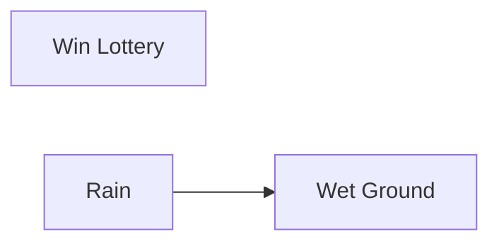
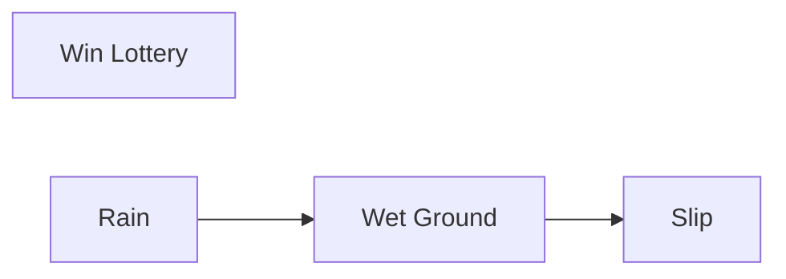
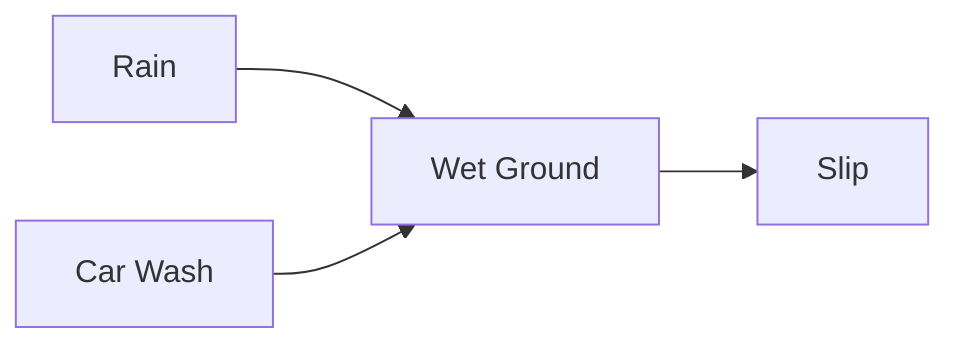
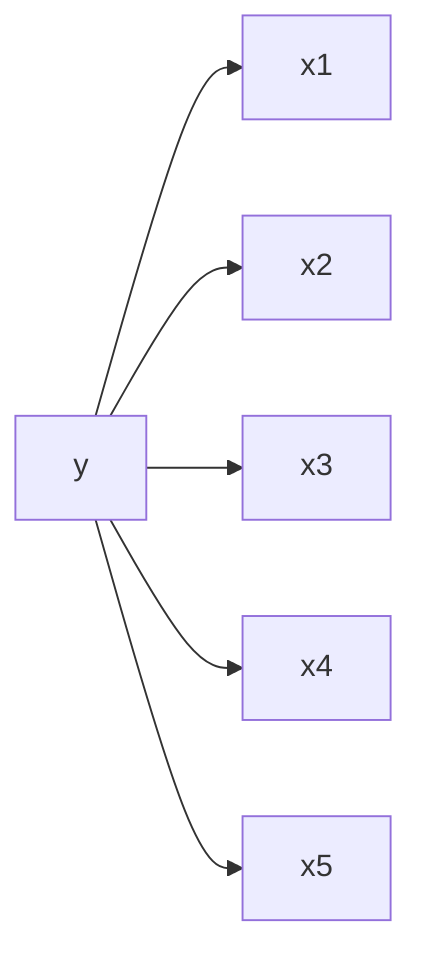
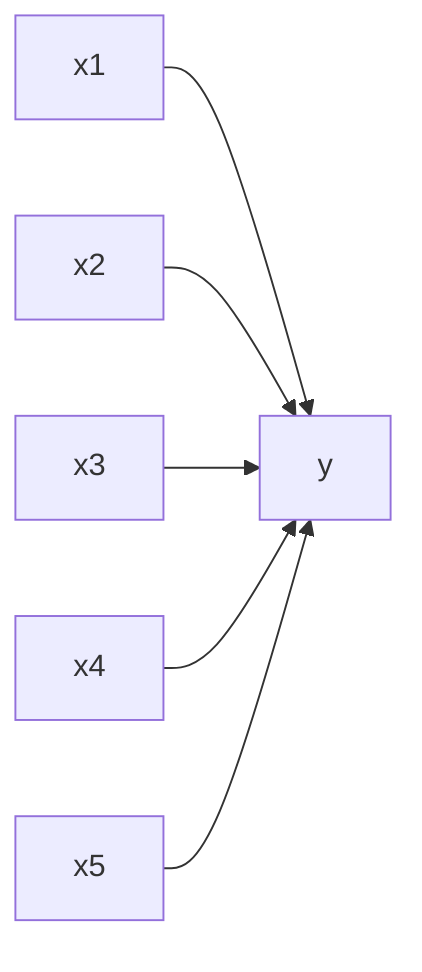
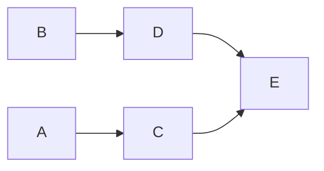

# Probalistic graphical models
It is a way of representing probability distribution. And here the distribution is encoded that we can read the conditional independence strcuture in graphs. As a result we can encode what variables are independent of other variables, encode this in a graph, so we can use graph algorithms to do inference and learning. As a result use Computer Science to reason about probabilties.

## Bayesian Networks

Basyesian networks are used to define bayesian independence structure. What makes a network bayesian, its the nodes in the network and the edges are directed edges. Thus there is a directionality that describes the conditional probability. As a result Bayesian networks has a conditional independence structure. 

Then the full joint probability distribution $P(L, R, W)$ = $P(L)P(R)P(W|R)$

Full joint probability distribution $P(L, R, W, S)$ = $P(L)P(R)P(W|R)P(S|W)$

So the general idea is $P(X|Parents(X))$

$P(R, C, W, S) = P(R)P(C)P(W|R,C)P(S|W)$

Now lets take two examples:

$p(y)\prod_{i=1}^{5}p(x_{i}|y)$

This looks like the naive bayes 

$\prod_{i=1}^{5}p(x_{i})y(x_1|x_2|x_3|x_4|x_5)$

And this looks like logistic regression (with i/p likelihood)

*Conclusion:* Naive bayes has a nice probability distribution in terms of efficiency The reason for this lies in The independence in Bayes Nodes.

## Independence in Bayes Nodes
Each variable is conditionally independent of its non-descendent given its parents. That is each variable is conditionally independent of any other variable given its Markov blanket. 

**Markov blanket:** Parents, children, children's parents. 

Node C's markov blanket is A, D, and E. 

How we can use this independence?

## Inference
Now given a bayesian network describing $P(X, Y, Z)$, what is $P(Y)$?

**Approach1: Enumeration**

If we had the distribution we looked at before $P(L, R, W, S)$ = $P(C)P(R)P(W|C, R)P(S|W)$
And now i just want to know if its raining or not, then

$P(R) \propto \sum_{w} \sum_{c} P(R)P(C)P(W|C,R)P(S|W)$

Now we had to sum over all possible w and c values, which will increase the complexity as the number of variables increase. We should see how we can take advtange of the bayesian structure to alleviate this problem.