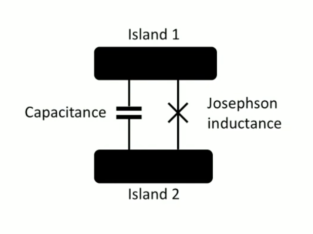
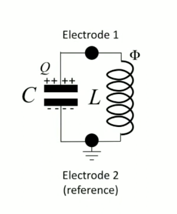
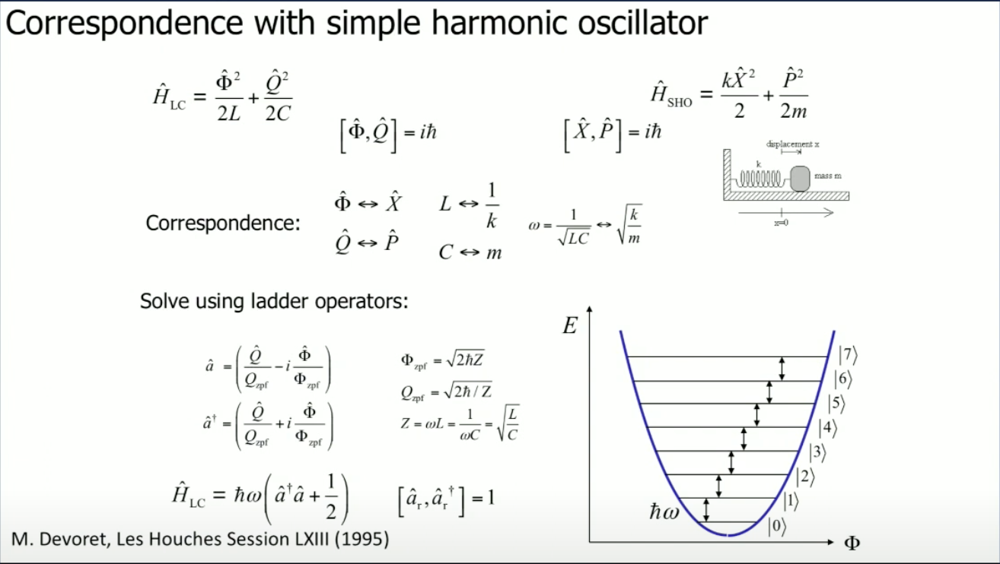
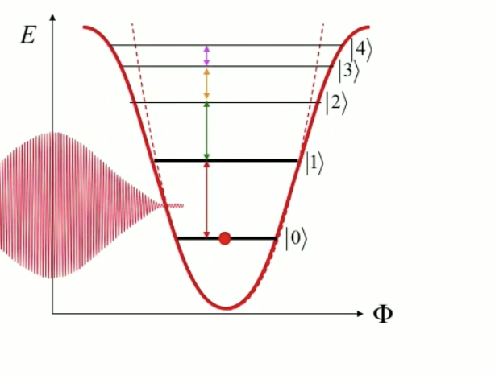

Source ([Qutech Academy](https://www.youtube.com/watch?v=cb_f9KpYipk&t=162s))

Qubits are defined as something having two states 0 and 1, ground and excited state. For example: electron spins are truly quantum in nature. Other examples include spin of a nuclei liek C13 or Si29.
Whereas transmon/superconducting qubits are manmade qubits. How are they different?

- They are multilevel systems, here they can be used as two level system by confining the enerygy dynamics.
- These qubits are fabricated circuits. 
  - Pros: freedom to design 
  - Con: Each qubit different 

Facts about superconducting qubits
- There are numerous varities of superconducting qubits: charge qubits , flux qubits and phase qubits etc.
- These qubits differ in number of superconducting islands, the number of junctions and also the relative enerygy scales of capacitive and inductive terms.
- Superconducting qubits usually works in the frequency range of 4-8GHz ($f_{01}$)
- Using placks constant we can relate the $f_{01}$ and $E_{01}$ , where $E_{01}$ is the energy difference between 0 and 1 states.
- This $f_{01}$ is also the frequency we will need to induce coherent transitions between these levels. 

Transmon qubits
- Known as the derivative of charge qubits
- This is how a basic transmon qubit looks like
- This Inductor and capicatance forms an LC oscillator. 

General LC Oscillator Hamiltonian
- Hamiltonian of LC oscillator $H = \frac{Q^2}{2C} + \frac{\phi^2}{2L}$ 
  

- Its important to note that charge and flux do not commute, they are cannonically conjugate variable.
- This hamiltonian has correspondance to harmonic oscillator.

Here we can see that the spectrum of the LC oscillator is perfectly harmonic (equally spaced in energy levels).

But such a spectrum wont make a good qubit, because its very difficult to confine dynamics to just two levels, so leekage out of the qubit subspace is permanent threat.

Solution? - Josephson juction, these change the energy spectrum of the new Hamiltonian.

QuTech uses two Josephson juctions in parallel, this gives them the possibility to tune the inductive element and also the qubit transition frequency by threading a magnetic flux through the loop defined by two junctions. In short they have flux controlled transmon qubits. 

